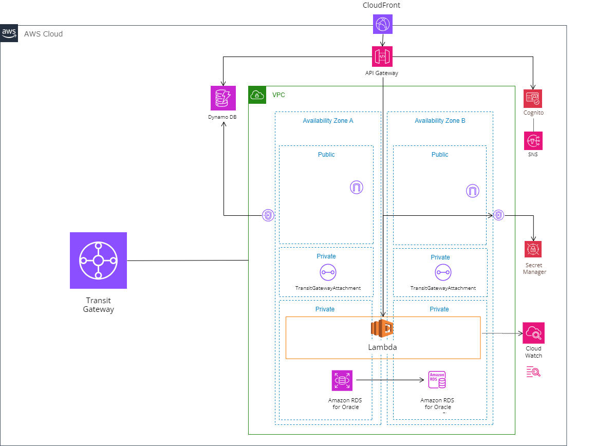
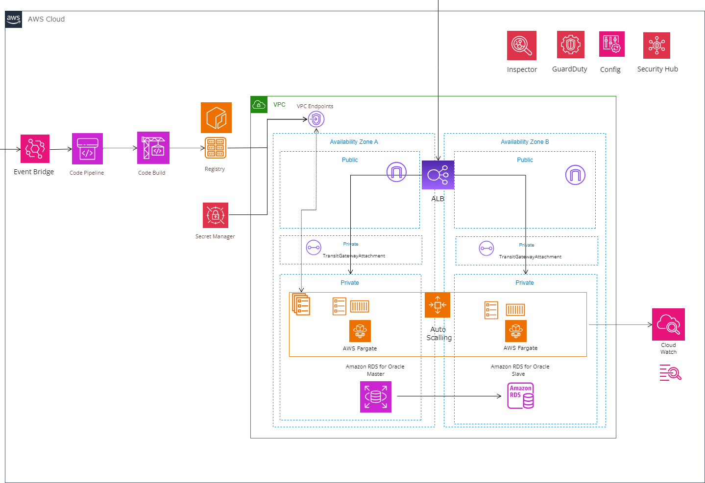

# Common infrastructure design

## 概要
このリポジトリは`共通認証基盤`及び、`共通アプリ環境`のインフラ構築を管理するIACとドキュメントが格納されています。

IACは全て`AWS CDK (Typescript)`で記載しています。

### ディレクトリ概要
```
├── auth # 共通認証基盤IAC
├── common # 共通アプリ環境IAC
├── devops # DEVOPSアカウントIAC
├── docs # 各種ドキュメント
├── README.md
```

## 構築手順

### 事前準備

事前準備として以下のツールがインストールされている必要があります。
- [AWS CLI](https://docs.aws.amazon.com/ja_jp/cli/latest/userguide/cli-chap-install.html)
- [AWS CDK](https://docs.aws.amazon.com/ja_jp/cdk/latest/guide/getting_started.html)
- [CLIの認証設定](https://docs.aws.amazon.com/ja_jp/cli/latest/userguide/cli-configure-files.html)
- Node.js 実行環境 (v18以上で動作確認済)

### 手順

- [認証基盤環境のCDK手順](./auth/README.md)
- [アプリ環境のCDK手順](./common/README.md)
- [DEVOPS環境のCDK手順](./devops/README.md)
- [コンソールからのパイプライン作成方法](./docs/02_pipeline_console_setup.md)

### 構築環境

auth


common


### 備考
[ローカルパッケージのCDKバージョンを上げるには](https://kdnakt.hatenablog.com/entry/2019/02/06/080000)
