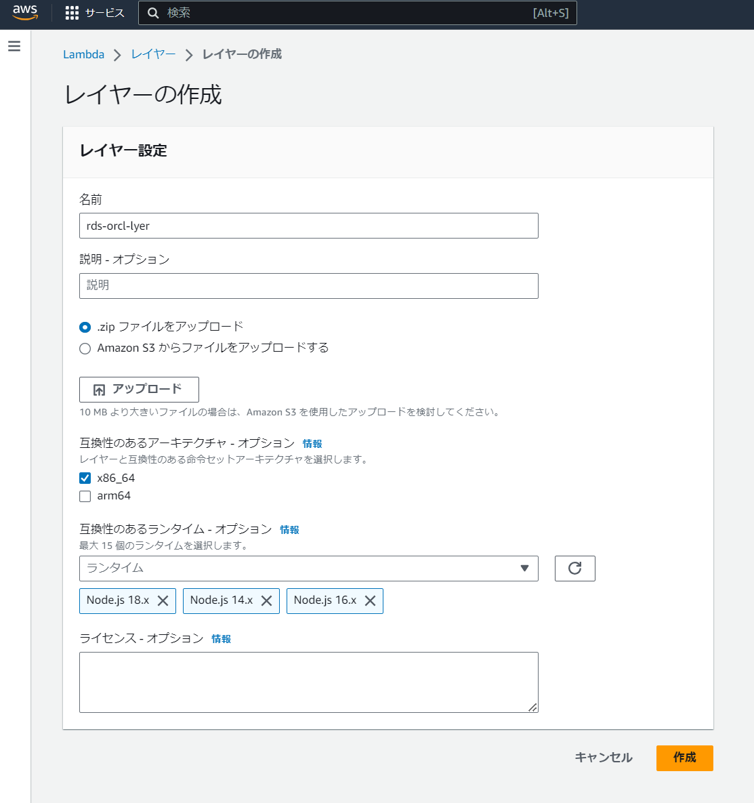
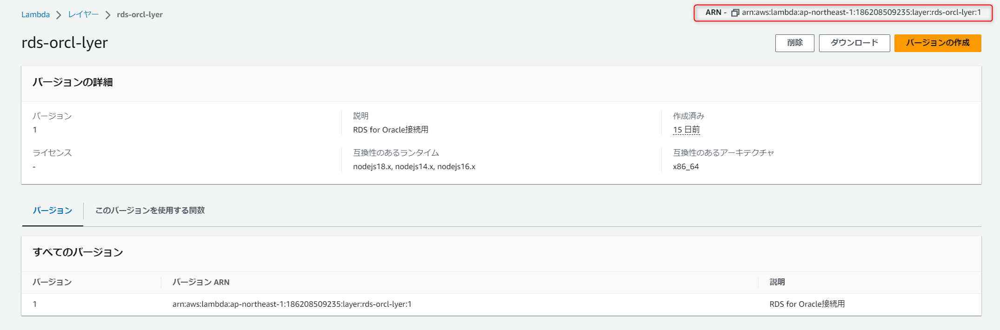
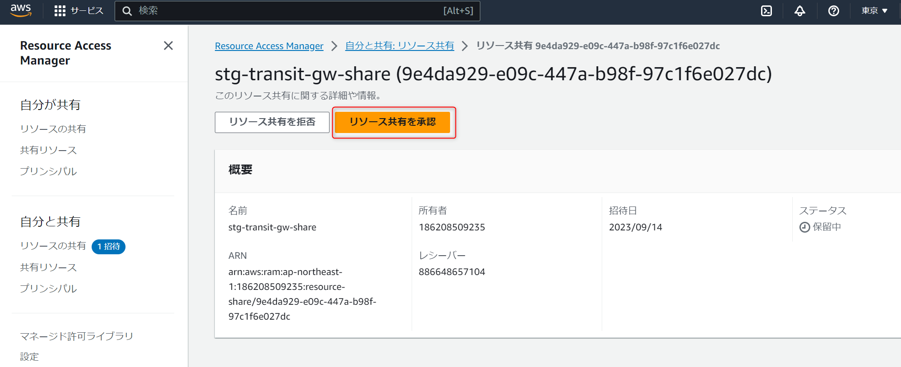
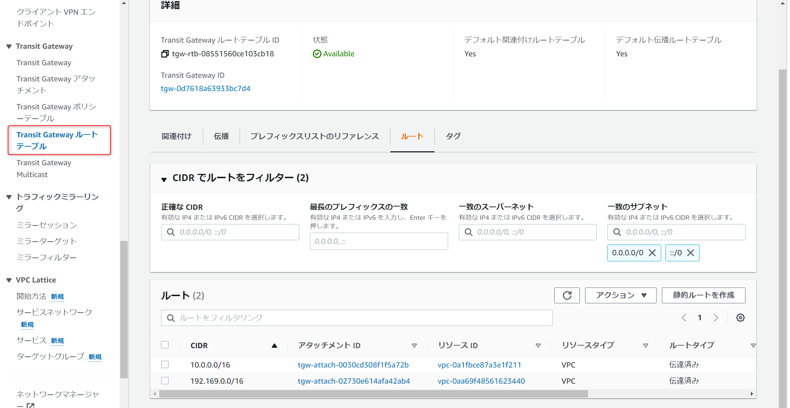

# 認証基盤環境CDK

## 概要
認証基盤環境のCDKデプロイ手順について記載します。

## ディレクトリ概要
```
├── bin 
│     └── auth.ts #CDKのエントリポイント
├── lambda
│     └── index.ts #サンプル用Lambdaコード
├── lib
│     ├── ApiGatewayStack.ts #APIGwを構築するStack
│     ├── CloudFrontStack.ts #CloudFrontを構築するStack
│     ├── CognitoStack.ts #Cognitoを構築するStack
│     ├── DataBaseStack.ts #RDS(Oracle)を構築するStack
│     ├── DynamoStack.ts #DynamoDBを構築するStack
│     ├── LambdaStack.ts #計3つのLambdaを構築するStack。
│     ├── NetworkStack.ts #VPC、TransitGatewayを構築するStack
│     ├── RamStack.ts #他アカウントに対してTransitGw共有を構築するStack
│     ├── RouteTableModifyStack.ts #TransitGwへのルーティングを変更するStack
│     ├── resources
│     │     ├── createCognitoTrigeerLambda.ts #Cognitoのトリガー用Lambdaを作成
│     │     ├── createGetDbLambda.ts #DBデータ取得用Lambdaを作成
│     │     └── createPutDbLambda.ts #DBデータ登録用Lambdaを作成
├── test
├── cdk.json # CDKの設定ファイル
├── cdk.context.json # Cashファイル
├── package.json
├── package-lock.json
├── README.md
├── tsconfig.json
├── rds-orcl-lyer.zip #Lambdaのカスタムレイヤー
└── jest.config.js
```

## Usage Process
https://docs.aws.amazon.com/ja_jp/cdk/v2/guide/cli.html

* `npm ci`  - install node modules
* `npx cdk bootstrap`  - bootstrap the CDK app (only once)
* `npx cdk list`  - list all stacks in the app
* `npx cdk deploy <stack name>`  - deploy this stack to your default AWS account/region
* `npx cdk context --clear` clear CASH
* `npx cdk diff`  - compare deployed stack with current state
* `npx cdk synth`  - emits the synthesized CloudFormation template
* `npx cdk destroy`     - destroy the stack


## デプロイ手順
以下の構成をデプロイする手順を記載します。


`cdk.json`内で設定されている環境変数を確認します。
```
  ...
  "context": {
    "projectName": "auth", //プロジェクト名 (必須)
    "deploymentStage": "prod", //デプロイステージ (必須)
    "deployAccount": "618024034594", //デプロイするアカウント (必須)
    "defaultRegion": "ap-northeast-1", //リージョン (必須)
    "targetAwsAccount": ["967185805673"], //Tgw共有先アカウント (Tgw接続で使用)
    "targetCidrBlocks": ["192.169.0.0/16"], //共有先アカウントのCIDR (Tgw接続で使用)
    ...
```

要件に応じ、各スタックのコードを変更するようにしてください。

スタックリストを確認します。
```bash
npx cdk list

****-****-NetworkStack
****-****-DatabaseStack
****-****-LambdaStack
****-****-CognitoStack
****-****-DynamoDbStack
****-****-ApigatewayStack
****-****-CloudFrontstack
****-****-RamStack
****-****-RouteModifyStack
```


以下の順番でデプロイを行います。

1. VPC
   - `npx cdk deploy <prod/stg>-<projectName>-Networkstack`
2. Database
   - `npx cdk deploy <prod/stg>-<projectName>-DatabaseStack`
3. Lambda
   - デプロイ前にカスタムレイヤーの設定を行います。
     - [Lambdaのカスタムレイヤー設定](##Lambdaのカスタムレイヤー設定)を参照してください。
   - `npx cdk deploy <prod/stg>-<projectName>-LambdaStack`
4. Cognito
   - `npx cdk deploy <prod/stg>-<projectName>-CognitoStack`
5. DynamoDB
    - `npx cdk deploy <prod/stg>-<projectName>-DynamoDbStack`
6. APIGateway
    - `npx cdk deploy <prod/stg>-<projectName>-ApigatewayStack`
7. CloudFront
    - `npx cdk deploy <prod/stg>-<projectName>-CloudFrontstack`


コンソールから各リソースの確認をおこない、正常にデプロイできているかを確認してください。

ここまでで、上記構成のリソースが展開されました。

## Lambdaのカスタムレイヤー設定
新規のアカウントで認証基盤環境の構築をおこなう場合は、Lamdaのカスタムレイヤーを作成する必要があります。

コンソールから、Lambda > レイヤー > レイヤーの作成 へ移動し、`auth/rds-orcl-lyer.zip`のZipファイルをアップロードしてください。



作成するとARNが確認できますので、こちらをメモしてください。



LambdaStackのコードを一部書き換えます。

`bin/auth.ts`
```typescript
const LambdaCdkStack = new LambdaStack(app, `${DEPLOYMENT_STAGE}-${PROJECT_NAME}-LambdaStack`, { 
  deploymentStage: DEPLOYMENT_STAGE,
  CustomLyerArn: "<作成したレイヤーのARN>",
  env: {
    account: DEPLOY_ACCOUNT,
    region: DEFAULT_REGION,
  },
  description: "This stack creates a Lambda.",
});
```

以上で、Lambdaのカスタムレイヤーの設定は終了です。

### 参考
[Lambdaレイヤー](https://docs.aws.amazon.com/ja_jp/lambda/latest/dg/chapter-layers.html)

## TransitGatewayとの追加接続

認証基盤環境のTransitGatewayを介してVPC間の接続をおこないます。

### 前提
- アプリケーション環境へのコンソールアクセス権を有していること

### 1. リソースアクセスマネージャーを使用し、別アカウントへTransitGatewayのリソース共有をおこいます。
`cdk.json`の`targetAwsAccount`に対象のアカウントIDを追加します。

```
  ...
  "context": {
    ...
    "targetAwsAccount": ["967185805673","<追加のアカウント>"],
    ...
```
スタックをデプロイします。
```bash
npx cdk deploy <prod/stg>-<projectName>-Ramstack
```

**アプリケーション環境の**コンソールへ移動し、リソースアクセスマネージャーからTransitGatewayのリソース共有を承認します。



### 2.TransitGatewayのルートテーブルを変更します。
#### 前提
**アプリケーション環境**の方でTransitGatewayへのルート設定を変更する必要があります。

こちらの手順は[アプリ環境のCDK手順](../common/README.md)の[TransitGatewayへの接続](../common/README.md#TransitGatewayへの接続)を参照してください。

#### 手順
cdk.jsonの`targetCidrBlocks`に対象のCIDRを追加します。

```
  ...
  "context": {
    ...
    "targetCidrBlocks": ["192.169.0.0/16","<追加のアカウントのCIDR>"],
    ...
```

スタックをデプロイします。
```bash
npx cdk deploy <prod/stg>-<projectName>-RouteModifyStack
```

共通基盤環境のコンソールへ移動し、TransitGatewayのルートテーブル確認し正しく設定できているか確認します。

VPC > TransitGateway > TransitGatewayルートテーブル



以上で、TransitGatewayを介したVPC間の接続は完了です。

疎通確認ではPrivateSubnet内に互いにEC2を配置し、別VPCのEC2に対してpingを実行して確認するのが最も簡単です。

---

## 参考URL
- [AWS CDKの開始方法](https://docs.aws.amazon.com/ja_jp/cdk/v2/guide/getting_started.html)
- [TransitGatewayとは](https://docs.aws.amazon.com/ja_jp/vpc/latest/tgw/what-is-transit-gateway.html)
- [TransitGateway ハンズオン](https://catalog.us-east-1.prod.workshops.aws/workshops/e0d1c19d-c80b-4695-a3fc-5c4a25132f47/ja-JP/)

---

＞ [TOP](../README.md)

＞ [アプリ環境のCDK手順](../common/README.md)
 


