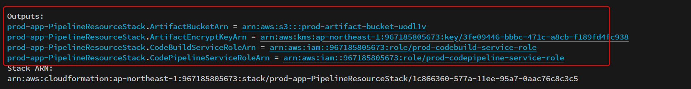

# アプリ環境CDK

## 概要
アプリケーション環境のCDKデプロイ手順について記載します。

## ディレクトリ概要
```
├── bin 
│     └── app.ts #CDKのエントリポイント
├── lib
│     ├── AppBaseStack.ts #RDSとECSを構築するStack
│     ├── EcrStack.ts #ECRレポジトリを構築するStack
│     ├── PipelineResourceStack.ts #CI/CDパイプラインに必要なリソースを構築するStack
│     ├── PipelineStack.ts #Codeパイプラインとイベントブリッジを構築するStack
│     ├── TransitGwAttachmentStack.ts #TransitGatewayへのルートを設定するStack
│     ├── VpcStack.ts #VPCを構築するStack
│     ├── resources
│     │     ├── createArtifactBucket.ts.ts #ArtifactBucket作成
│     │     ├── createArtifactKey.ts #KMS暗号化キー作成
│     │     ├── createCodeBuildRole.ts #CodeBuild用IAMロール作成
│     │     ├── createCodePipelineRole.tss #CodePipeline用IAMロール作成
│     │     ├── createDataBase.ts #RDS for Oraclの作成
│     │     ├── createEcsfargate.ts #ECS Fargate作成
│     │     ├── createEventBridge.ts #EventBridge作成
│     │     └── createPipeline.ts #CodePipeLine作成
├── test
├── cdk.json # CDKの設定ファイル
├── cdk.context.json # Cashファイル
├── package.json
├── package-lock.json
├── README.md
├── tsconfig.json
└── jest.config.js
```

## Usage Process
https://docs.aws.amazon.com/ja_jp/cdk/v2/guide/cli.html

* `npm ci`  - install node modules
* `npx cdk bootstrap`  - bootstrap the CDK app (only once)
* `npx cdk list`  - list all stacks in the app
* `npx cdk deploy <stack name>`  - deploy this stack to your default AWS account/region
* `npx cdk context --clear` clear CASH
* `npx cdk diff`  - compare deployed stack with current state
* `npx cdk synth`  - emits the synthesized CloudFormation template
* `npx cdk destroy`     - destroy the stack

## デプロイ手順

`cdk.json`内で設定されている環境変数を確認、適宜変更します。

```bash
npx cdk list

...
***-***-EcrStack
***-***-VpcStack
***-***-AppBaseStack
***-***-TgwAttachmentStack
***-***-PipelineResourceStack
***-***-PipelineStack
```

以下の順番でデプロイを行います。

1. ECRレポジトリの作成
   - `npx cdk deploy <prod/stg>-<projectName>-EcrStack`
   - 作成後は仮のイメージをpushしてください。
     - ECRレポジトリにイメージがないと、後続のECSデプロイ時にエラーになります。
     - 参考URL: [Dockerイメージのプッシュ](https://docs.aws.amazon.com/AmazonECR/latest/userguide/docker-push-ecr-image.html)

2. VPC関連リソースの作成
   - `npx cdk deploy <prod/stg>-<projectName>-VpcStack`

3. ECSとRDS関連をまとめて作成
   - `npx cdk deploy <prod/stg>-<projectName>-AppBaseStack`

---

### 参考
- [AWS CDKの開始](https://docs.aws.amazon.com/ja_jp/cdk/v2/guide/getting_started.html)
- [Fargate で Amazon ECS サービスの Auto Scaling を設定するにはどうすればよいですか?](https://repost.aws/ja/knowledge-center/ecs-fargate-service-auto-scaling)
- [サービスの自動スケーリング](https://docs.aws.amazon.com/ja_jp/AmazonECS/latest/userguide/service-auto-scaling.html)


## パイプラインの作成手順

### 前提
- ECR, ECS Fargateが作成されており稼働状態である事。

### 手順
1. アプリ環境アカウントに、パイプラインで必要なリソースをまとめて作成します。
2. DEVOPS環境アカウントに、CodeCommitレポジトリとAssumeRoleできるIAMロールを作成します。
3. アプリ環境アカウントに、CodePipelineとEventBridgeを作成し、手動実行で確認します。
4. DEVOPS環境アカウントに、EventBridgeを作成します。
5. ブランチの変更を検知して、パイプラインが動作するか確認します。 

#### 1. アプリ環境アカウントに、パイプラインで必要なリソースをまとめて作成
`cdk.json` 内の環境変数を確認、適宜変更します。

スタックをデプロイします。
```bash
npx cdk deploy <prod/stg>-<projectName>-PipelineResourceStack
```
ここでは以下のファイルを実行、リソースを作成しています。

```
├── lib
│     ├── PipelineResourceStack.ts
│     ├── resources
│     │     ├── createArtifactBucket.ts.ts #ArtifactBucket作成
│     │     ├── createArtifactKey.ts #KMS暗号化キー作成
│     │     ├── createCodeBuildRole.ts #CodeBuild用IAMロール作成
│     │     ├── createCodePipelineRole.tss #CodePipeline用IAMロール作成
```

このスタックをデプロイすると、以下のような出力が表示されます。



この出力値をメモしておきます。

#### 2. DEVOPS環境アカウントに、CodeCommitレポジトリとAssumeRoleできるIAMロールを作成。
devopsデレクトリに移動します。
```bash
cd ../devops
```
`cdk.json`の`context`内環境変数を確認します。
```
...
  "context": {
    "projectName": "stadiumapp-common", //プロジェクト名
    "devOpsAccount": "216019509931", //デプロイ先アカウント
    "deployRegion": "ap-northeast-1", //デプロイ先リージョン
    ...
```
`devops/bin/devops.ts`の`CodeCommitStack`ではCodeCommitレポジトリを作成します。
repositoryNameは作成するレポジトリ名になるので適宜変更してください。

```typescript
const CodeCommitCdkStack = new CodeCommitStack(app, `${PROJECT_NAME}-CodeCommitStack`, {
    projectName: PROJECT_NAME,
    repositoryName: "<レポジトリ名>",
    env: {
        account: DEVOPS_ACCOUNT,
        region: DEPLOY_REGION,
    }
});
```

レポジトリのARNが出力されますので、こちらもメモしておきます。

続けて、`AssumeRoleStack`をデプロイします。

ここでは、マルチアカウントの実行権限有するIAMロールを作成します。
`devops/bin/devops.ts`の`envオブジェクト`に ① での出力値とCodeCommitレポジトリARNを設定していきます。

```typescript
const env = {
     //アプリ環境のAWSアカウント
    envAccountIds: ["<AWSアカウント>"],
     //①で出力されたアーティファクトバケットARN
    artifactBucketArns: ["arn:aws:s3:::*********"],
     //①で出力されたアーティファクトバケットの暗号化キーARN
    artifactEnCryptKeyArns: ["arn:aws:kms:<Region>:<account>:key/*********"],
     //CodeCommitのリポジトリARN
    codeCommitRepoArn: "arn:aws:codecommit:<Reagion>:<account>:****",
}
```

※CodeCommitレポジトリが既に作成されている場合はそのARNを設定してください。以下のCLIコマンドで確認できます。

`aws codecommit get-repository --repository-name <RepoName>`

変数の設定が完了したら、スタックをデプロイします。
```bash
npx cdk deploy <prod/stg>-<projectName>-AssumeRoleStack
```

IAMロールのARNが出力されますので、こちらもメモしておきます。

#### 3. アプリ環境アカウントに、CodePipelineとEventBridgeを作成し、手動実行で確認。

commonディレクトリに移動します。
```bash
cd ../common
```
`PipelineStack`ではCodePipelineとEventBridgeをまとめて作成します。

`common/bin/app.ts`の`PipelineStack`で設定されている変数の値を①、②でメモしたARNに変更していきます。

ECRレポジトリのURIはコンソールもしくはCLIで確認してください。ECRのURIは以下のCLIコマンドで確認できます。

`aws ecr describe-repositories --repository-names <ECRレポジトリ名>`

`common/bin/app.ts`
```typescript
const PipelineCdkStack = new PipelineStack(app, `${DEPLOYMENT_STAGE}-${PROJECT_NAME}-PipelineStack`, {
    devopsAccountId: DEVOPS_ACCOUNT,
    deploymentStage: DEPLOYMENT_STAGE,
    projectName: PROJECT_NAME,
    ecrRepositoryUri: "<ECRレポジトリのURI>",
    FargateService: AppBaseCdkStack.fargateService,
    targetBranch: "<起動の契機となるブランチ名>",
    artifactBucketArn: "<①で出力されたアーティファクトバケットARN>",
    artifactEncryptKeyArn: "<①で出力されたアーティファクトバケットの暗号化キーARN>",
    codeBuildServiceRoleArn: "<①で出力されたCodeBuild用IAMロールARN>",
    codePipelineServiceRoleArn: "<①で出力されたCodePipeline用IAMロールARN>",
    codeCommitRepositoryArn: "<対象のCodeCommitレポジトリARN>",
    codeCommitAccessRoleArn: "<②で出力されたAssumeRole用IAMロールARN>",
    env: {
        account: DEPLOY_ACCOUNT,
        region: DEPLOY_REGION,
    },
    description: `This Stack is Create ${DEPLOYMENT_STAGE}-CodePipeline`
});
```
スタックをデプロイします。
```bash
npx cdk deploy <prod/stg>-<projectName>-PipelineStack
```

デプロイが完了したら、EventBridgeのコンソールを開き、イベントバスの設定及びイベントルールが作成されていることを確認します。

ここまでで、パイプラインを手動実行で確認できます。CodePipelineのコンソールから手動でパイプラインを実行し動作確認します。

#### 4. DEVOPS環境アカウントに、EventBridgeを作成。
devopsディレクトリに移動します。
```bash
cd ../devops
```
`EventBridgeStack`ではEventBridgeを作成します。

現状では、`main`と`staging`ブランチの変更を契機に動くイベントブリッジをそれぞれ別のスタックで作成するようにしています。

変数の値を適宜変更し、対象のスタックをデプロイしてください。

`devops/bin/devops.ts`
```typescript
const EventBridgeCdkStack = new EventBridgeStack(app, `${PROJECT_NAME}-***-EventBridgeStack`, {
    projectName: PROJECT_NAME,
    codeCommitRepoArn: env.codeCommitRepoArn,
    envAccountId: env.envAccountIds[0], //ターゲットとなるアカウントを指定
    deployRegion: DEPLOY_REGION,
    targetBranch: "<変更の契機となるブランチ名>",
    env: {
        account: DEVOPS_ACCOUNT,
        region: DEPLOY_REGION,
    }
});
```
```bash
npx cdk deploy <prod/stg>-<projectName>-***-EventBridgeStack
```
EventBridgeのコンソールを開き、イベントルールが作成されていることを確認します。

#### 5. ブランチの変更を検知して、パイプラインが動作するか確認。
最後に、ブランチの変更を検知して、パイプラインが動作するか確認します。

CodeCommitレポジトリの対象ブランチに変更を加えます。
パイプライン実行元アカウントへ移動し、CodePipelineのコンソールから実行履歴を確認します。

以上で、パイプラインの作成は完了です。

---
### 参考
- [AWS CDKの開始](https://docs.aws.amazon.com/ja_jp/cdk/v2/guide/getting_started.html)
- [イベントベースの変更検出を使用するようにポーリング パイプラインを移行する](https://docs.aws.amazon.com/codepipeline/latest/userguide/update-change-detection.html#update-change-detection-codecommit)
- [AWS CodeCommitとAWS CodePipelineを使用して複数のAWSアカウントにCI/CDパイプラインをデプロイする](https://docs.aws.amazon.com/ja_jp/prescriptive-guidance/latest/patterns/use-aws-codecommit-and-aws-codepipeline-to-deploy-a-ci-cd-pipeline-in-multiple-aws-accounts.html)

---

## TransitGatewayへの接続
ここでは認証基盤環境のTransitGatewayへのルートをCDKを用いて設定します。

### 前提
- 認証基盤環境のTransitGatewayのリソースアクセスマネージャーによるリソース共有が完了していること。

### 手順
`TgwAttachmentStack`をデプロイしTransitGatewayへの経路を設定します。
現状はPrivateSubnetのルートテーブルに経路を設定するようにしていますが、要件に応じて適宜コードを変更してください。

`cdk.json`、context内の環境変数を確認、適宜変更します。

デプロイをおこないます。
```bash
npx cdk deploy <prod/stg>-<projectName>-TgwAttachmentStack
```

コンソールからPrivatesubnetのルートテーブルを確認し、TransitGatewayへの経路が設定されていることを確認します。

---

＞ [認証基盤のCDK手順](../auth/README.md)

＞ [DevOps環境のCDK手順](../devops/README.md)

＞ [コンソールからのパイプライン設定](../docs/02_pipeline_console_setup.md)

＞ [TOP](../README.md)


