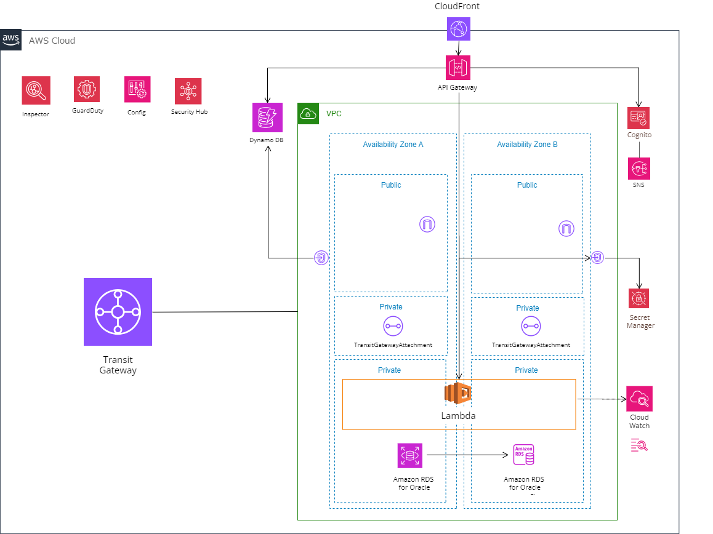

# CDKのセットアップとインフラ構成

ここではCDKのセットアップとインフラ構成に関して記載します。

各環境のデプロイ手順と詳細に関しては、各ディレクトリのREADMEに記載されています。

## 各ディレクトリにおけるインフラ構成の範囲

### 認証基盤

**認証基盤**のIACは以下のディレクトリに格納されています。
```
.
├── auth # 共通認証基盤IAC
```



展開されるリソースは上記構成が基本になりますが、必要に応じ以下別途デプロイされるリソースがあります。

- CDKカスタムリソース
- EC2 (RDSへの踏み台用)
- SSM パラメータストア (CDKスタック間の依存関係を疎結合にする為、各種IDやパラメータを格納してます)
- 他、各種サービスに必要なIAMロール及びポリシー、依存するリソース類(S3等)

### 共通アプリ環境

**共通アプリ環境**のIACは以下のディレクトリに格納されています。
```
.
├── common # 共通アプリ環境IAC
```


展開されるリソースは上記構成が基本になりますが、必要に応じ以下別途デプロイされるリソースがあります。

- CDKカスタムリソース
- EC2 (RDSへの踏み台用)
- SSM パラメータストア (CDKスタック間の依存関係を疎結合にする為、各種IDやパラメータを格納してます)
- 他、各種サービスに必要なIAMロール及びポリシー、依存するリソース類(S3等)

### DEVOPSアカウント

**DEVOPSアカウント**のIACは以下のディレクトリに格納されています。
```
.
├── devops # DEVOPSアカウントIAC
```
DEVOPSアカウントでは、以下のリソースをデプロイします。
- AWS CodeCommitレポジトリ
- CI/CDパイプライン用のIAMロール及びポリシー
- CI/CDパイプライン用のEventBridge

## CDKのセットアップ

このレポジトリをクローン後、対象環境のディレクトリに移動し、依存関係のインストールを行います。

```bash
cd common
```
```bash
npm ci
```
```bash
npx cdk --version
2.95.1 (build ae455d8)
```
ローカルパッケージのCDKバージョンを使用します。

なお、ローカルパッケージのCDKバージョンアップを行う場合は[こちら](https://kdnakt.hatenablog.com/entry/2019/02/06/080000)が参考になります。

スタックリストを確認します。
```bash
npx cdk list

***-***-****Stack
***-***-****Stack
***-***-****Stack
...
```
スタックリストが表示されていれば、セットアップは問題なく完了しています。

各種CDKコマンドの詳細は[こちら](https://docs.aws.amazon.com/ja_jp/cdk/v2/guide/cli.html)を参照してください。

https://docs.aws.amazon.com/ja_jp/cdk/v2/guide/cli.html

---

以降の手順は各環境毎で異なる為、各環境毎のREADMEを参照してください。

また、CI/CDパイプラインの構築に関してはコンソールからの構築手順も記載していますのでご参考ください。

＞ [共通認証基盤](../auth/README.md)

＞ [アプリ環境](../common/README.md)

＞ [DEVOPSアカウント](../devops/README.md)

＞ [コンソールからのパイプライン作成方法](../docs/02_pipeline_console_setup.md)

＞ [TOP](../README.md)


